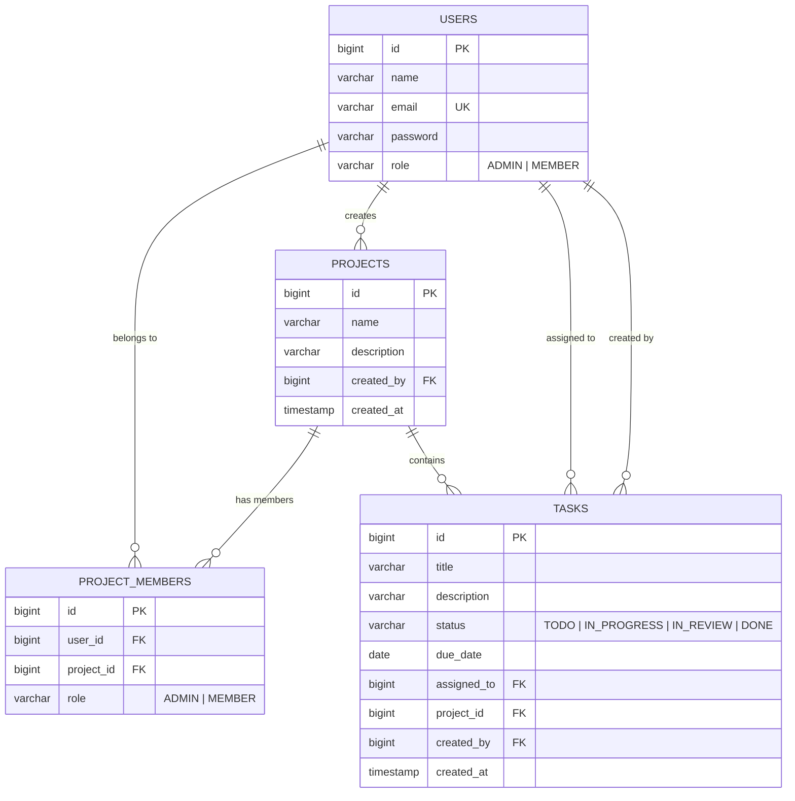

<](https://openjdk.org/)
[](https://spring.io/projects/spring-boot)
[](https://www.postgresql.org/)
[](LICENSE)

[Features](#-features) · [Architecture](#-architecture) · [Quick Start](#-quick-start) · [Deployment](#-deployment) · [API Reference](#-api-reference)

</div>

---

## 📋 Overview

**Ethara** (meaning *"impact"*) is a modern, secure team task management application designed for collaborative project workflows. It provides a Kanban-style task board, role-based access control, real-time dashboard analytics, and an admin panel — all wrapped in a clean, minimalist black-and-white UI.

Built as a monolithic Spring Boot application with server-rendered Thymeleaf templates, Ethara is optimized for fast deployment on platforms like **Render**, **Railway**, and **Heroku**, or via **Docker**.

---

## ✨ Features

### 🔐 Authentication & Security
- **JWT-based authentication** with HTTP-only cookie transport
- **BCrypt password hashing** for secure credential storage
- **Dual security filter chains** — stateless API layer + cookie-based web layer
- **XSS protection**, `X-Frame-Options`, and content-type sniffing prevention
- **CORS configuration** with environment-variable-driven allowed origins
- **Role-based access control** — `ADMIN` and `MEMBER` system roles

### 📊 Dashboard
- Real-time summary metrics: total tasks, completed, pending, overdue
- Task distribution breakdown by status (TODO, IN_PROGRESS, IN_REVIEW, DONE)
- Project count at a glance
- Overdue task alerts with visual indicators
- Personalized per-user analytics

### 📁 Project Management
- Create and manage multiple projects
- Add team members to projects with project-level roles (`ADMIN` / `MEMBER`)
- Project-scoped task isolation — tasks belong to projects
- Unique membership constraints (one role per user per project)

### ✅ Task Board (Kanban)
- **Four-column Kanban board**: TODO → IN_PROGRESS → IN_REVIEW → DONE
- Drag-and-drop style status updates via API
- Task assignment to project members
- Due date tracking with automatic overdue detection
- Rich task descriptions (up to 2,000 characters)
- Task creation with automatic creator tracking

### 🛡️ Admin Panel
- System-wide user management (view all users, assign roles, delete users)
- Global visibility into all projects and tasks across the platform
- Protected with `ADMIN`-only authorization

### 🎨 UI / UX
- Minimalist, modern **black-and-white aesthetic**
- Server-rendered **Thymeleaf** templates with dynamic JavaScript
- Responsive design for desktop and mobile
- Clean typography and intuitive navigation

---

## 🏗 Architecture

```
┌─────────────────────────────────────────────────────────┐
│                     CLIENT BROWSER                      │
│            (Thymeleaf HTML + Vanilla JS)                │
└─────────────────┬───────────────────────────────────────┘
                  │  HTTP (Cookie: JWT)
                  ▼
┌─────────────────────────────────────────────────────────┐
│                  SPRING BOOT 3.4.5                      │
│  ┌────────────┐  ┌────────────┐  ┌──────────────────┐  │
│  │  Security   │  │    Web     │  │    REST API      │  │
│  │  Filters    │──│ Controller │  │   Controllers    │  │
│  │ (JWT Auth)  │  │ (Pages)   │  │  (/api/**, /auth) │  │
│  └────────────┘  └─────┬──────┘  └────────┬─────────┘  │
│                        │                   │            │
│                  ┌─────▼───────────────────▼─────────┐  │
│                  │          SERVICE LAYER             │  │
│                  │  Auth · Project · Task · Dashboard │  │
│                  │              Admin                 │  │
│                  └─────────────────┬─────────────────┘  │
│                                   │                     │
│                  ┌────────────────▼──────────────────┐  │
│                  │      SPRING DATA JPA REPOS        │  │
│                  │  User · Project · ProjectMember   │  │
│                  │            Task                   │  │
│                  └────────────────┬──────────────────┘  │
└───────────────────────────────────┼─────────────────────┘
                                    │ JDBC
                                    ▼
                         ┌─────────────────────┐
                         │    PostgreSQL 16     │
                         │   (ethara_taskmanager)│
                         └─────────────────────┘
```

### Tech Stack

| Layer          | Technology                                      |
|----------------|--------------------------------------------------|
| **Language**   | Java 21                                          |
| **Framework**  | Spring Boot 3.4.5                                |
| **Security**   | Spring Security 6 + JWT (jjwt 0.12.6)           |
| **Database**   | PostgreSQL with Spring Data JPA / Hibernate      |
| **Templating** | Thymeleaf + Thymeleaf Extras (Spring Security 6) |
| **Frontend**   | Vanilla JavaScript + CSS                         |
| **Build**      | Maven (with Maven Wrapper)                       |
| **Deployment** | Docker, Render, Heroku-compatible                |

---

## 🚀 Quick Start

### Prerequisites

- **Java 21** (JDK)
- **PostgreSQL 16+** running locally
- **Maven 3.9+** (or use the included Maven Wrapper)

### 1. Clone the Repository

```bash
git clone https://github.com/your-username/ethara.git
cd ethara/App
```

### 2. Set Up the Database

```sql
CREATE DATABASE taskmanager;
```

> [!NOTE]
> The default credentials in `application.properties` expect a local PostgreSQL instance on port `5432`. Adjust the `DATABASE_URL`, `DATABASE_USERNAME`, and `DATABASE_PASSWORD` environment variables as needed.

### 3. Run the Application

**Using Maven Wrapper:**

```bash
# Windows
.\mvnw.cmd spring-boot:run -Dspring-boot.run.profiles=dev

# Linux / macOS
./mvnw spring-boot:run -Dspring-boot.run.profiles=dev
```

**Using your own Maven installation:**

```bash
mvn spring-boot:run -Dspring-boot.run.profiles=dev
```

### 4. Access the Application

Open your browser and navigate to:

```
http://localhost:8080
```

- **Sign up** for a new account at `/signup`
- **Log in** at `/login`
- You'll be redirected to the **Dashboard** after authentication

> [!TIP]
> The `dev` profile enables SQL logging, formatted output, and disables Thymeleaf caching for faster development iteration.

---

## ⚙️ Configuration

All configuration is externalized via environment variables with sensible defaults:

| Variable             | Default                                      | Description                        |
|----------------------|----------------------------------------------|------------------------------------|
| `PORT`               | `8080`                                       | Server port                        |
| `DATABASE_URL`       | `jdbc:postgresql://localhost:5432/taskmanager`| PostgreSQL JDBC connection string  |
| `DATABASE_USERNAME`  | `postgres`                                   | Database username                  |
| `DATABASE_PASSWORD`  | *(set in properties)*                        | Database password                  |
| `DB_POOL_SIZE`       | `5`                                          | HikariCP max pool size             |
| `JWT_SECRET`         | *(default hex key)*                          | HMAC-SHA256 signing key            |
| `JWT_EXPIRATION`     | `86400000` (24h)                             | Token expiration in milliseconds   |
| `DDL_AUTO`           | `update`                                     | Hibernate DDL strategy             |
| `THYMELEAF_CACHE`    | `true`                                       | Enable/disable template caching    |
| `SHOW_SQL`           | `false`                                      | Print SQL to console               |
| `LOG_LEVEL`          | `INFO`                                       | Root logging level                 |
| `CORS_ORIGIN`        | `http://localhost:8080`                       | Allowed CORS origins (comma-separated) |

> [!IMPORTANT]
> For production, always override `JWT_SECRET` with a strong, randomly generated key. Never use the default.

---

## 🐳 Docker

### Build & Run

```bash
cd App

# Build the image
docker build -t ethara .

# Run the container
docker run -d \
  --name ethara \
  -p 8080:8080 \
  -e DATABASE_URL=jdbc:postgresql://host.docker.internal:5432/taskmanager \
  -e DATABASE_USERNAME=postgres \
  -e DATABASE_PASSWORD=your_password \
  -e JWT_SECRET=your_production_secret_key \
  ethara
```

### Multi-Stage Build

The included `Dockerfile` uses a **two-stage build**:

1. **Build stage** (`eclipse-temurin:21-jdk`) — compiles the project and packages the JAR
2. **Runtime stage** (`eclipse-temurin:21-jre`) — runs the JAR as a non-root user for security

Includes a built-in health check hitting `/login` every 30 seconds.

---

## ☁️ Deployment

### Render (Recommended)

The project includes a `render.yaml` blueprint for one-click deployment:

1. Push your code to GitHub
2. Connect the repository to [Render](https://render.com)
3. Render auto-detects `render.yaml` and provisions:
   - **Web Service** (`ethara-task-manager`) — Java runtime, free plan
   - **PostgreSQL Database** (`ethara-db`) — auto-wired credentials
4. Environment variables (`JWT_SECRET`, `DDL_AUTO`, etc.) are configured automatically

### Heroku

The project includes a `Procfile` and `system.properties` for Heroku compatibility:

```bash
heroku create ethara-app
heroku addons:create heroku-postgresql:essential-0
git push heroku main
```

### Railway / Fly.io

Use the Docker-based deployment. Point to your PostgreSQL instance via environment variables.

---

## 📡 API Reference

All API endpoints require a valid JWT token passed via `Authorization: Bearer <token>` header or an HTTP-only cookie.

### Authentication

| Method | Endpoint           | Body                                         | Description           |
|--------|--------------------|----------------------------------------------|-----------------------|
| POST   | `/auth/signup`     | `{ name, email, password }`                  | Register a new user   |
| POST   | `/auth/login`      | `{ email, password }`                        | Login, returns JWT    |

### Projects

| Method | Endpoint                              | Description                    |
|--------|---------------------------------------|--------------------------------|
| GET    | `/api/projects`                       | List user's projects           |
| POST   | `/api/projects`                       | Create a new project           |
| POST   | `/api/projects/{id}/members`          | Add a member to a project      |
| DELETE | `/api/projects/{id}/members/{userId}` | Remove a member from a project |

### Tasks

| Method | Endpoint                       | Description                  |
|--------|--------------------------------|------------------------------|
| GET    | `/api/projects/{id}/tasks`     | List tasks in a project      |
| POST   | `/api/projects/{id}/tasks`     | Create a task in a project   |
| PUT    | `/api/tasks/{id}/status`       | Update task status           |

### Dashboard

| Method | Endpoint                    | Description                        |
|--------|-----------------------------|------------------------------------|
| GET    | `/api/dashboard/summary`    | Get summary metrics                |
| GET    | `/api/dashboard/my-tasks`   | Get tasks assigned to current user |
| GET    | `/api/dashboard/overdue`    | Get overdue tasks                  |

### Admin (ADMIN role only)

| Method | Endpoint                         | Description               |
|--------|----------------------------------|---------------------------|
| GET    | `/api/admin/users`               | List all users            |
| PUT    | `/api/admin/users/{id}/role`     | Change a user's role      |
| DELETE | `/api/admin/users/{id}`          | Delete a user             |

---

## 📁 Project Structure

```
App/
├── src/
│   ├── main/
│   │   ├── java/com/ethara/taskmanager/
│   │   │   ├── TaskManagerApplication.java    # Entry point
│   │   │   ├── controller/
│   │   │   │   ├── AuthController.java        # /auth/** endpoints
│   │   │   │   ├── ProjectController.java     # /api/projects/** endpoints
│   │   │   │   ├── TaskController.java        # /api/tasks/** endpoints
│   │   │   │   ├── DashboardController.java   # /api/dashboard/** endpoints
│   │   │   │   ├── AdminController.java       # /api/admin/** endpoints
│   │   │   │   └── WebController.java         # Thymeleaf page routes
│   │   │   ├── model/
│   │   │   │   ├── User.java                  # User entity (ADMIN/MEMBER)
│   │   │   │   ├── Project.java               # Project entity
│   │   │   │   ├── ProjectMember.java         # Many-to-many join entity
│   │   │   │   └── Task.java                  # Task entity (4 statuses)
│   │   │   ├── repository/                    # Spring Data JPA repositories
│   │   │   ├── service/                       # Business logic layer
│   │   │   ├── security/
│   │   │   │   ├── SecurityConfig.java        # Dual filter chain config
│   │   │   │   ├── JwtFilter.java             # JWT authentication filter
│   │   │   │   ├── JwtUtil.java               # Token generation/validation
│   │   │   │   └── CustomUserDetailsService.java
│   │   │   ├── dto/                           # Request/response DTOs
│   │   │   └── exception/                     # Global exception handling
│   │   └── resources/
│   │       ├── application.properties         # Production config
│   │       ├── application-dev.properties     # Dev profile overrides
│   │       ├── static/
│   │       │   ├── css/style.css              # Global stylesheet
│   │       │   └── js/app.js                  # Client-side logic
│   │       └── templates/
│   │           ├── login.html                 # Login page
│   │           ├── signup.html                # Registration page
│   │           ├── dashboard.html             # Dashboard view
│   │           ├── projects.html              # Project management
│   │           ├── taskboard.html             # Kanban task board
│   │           └── admin.html                 # Admin panel
│   └── test/                                  # Unit & integration tests
├── Dockerfile                                 # Multi-stage Docker build
├── Procfile                                   # Heroku process declaration
├── render.yaml                                # Render blueprint (IaC)
├── system.properties                          # Java version for Heroku
├── pom.xml                                    # Maven dependencies
└── mvnw / mvnw.cmd                            # Maven Wrapper scripts
```

---

## 🗄️ Database Schema



---

## 🧪 Testing

```bash
# Run all tests
./mvnw test

# Run with verbose output
./mvnw test -Dspring-boot.run.profiles=dev
```

The project includes dependencies for:
- **Spring Boot Test** — integration testing
- **Spring Security Test** — security layer testing

---

## 🤝 Contributing

1. **Fork** the repository
2. **Create** a feature branch (`git checkout -b feature/amazing-feature`)
3. **Commit** your changes (`git commit -m 'Add amazing feature'`)
4. **Push** to the branch (`git push origin feature/amazing-feature`)
5. **Open** a Pull Request

---

## 📝 License

This project is licensed under the **MIT License** — see the [LICENSE](LICENSE) file for details.

---

<div align="center">

**Built with ☕ Java and ❤️ by the Ethara team**

</div>
]]>