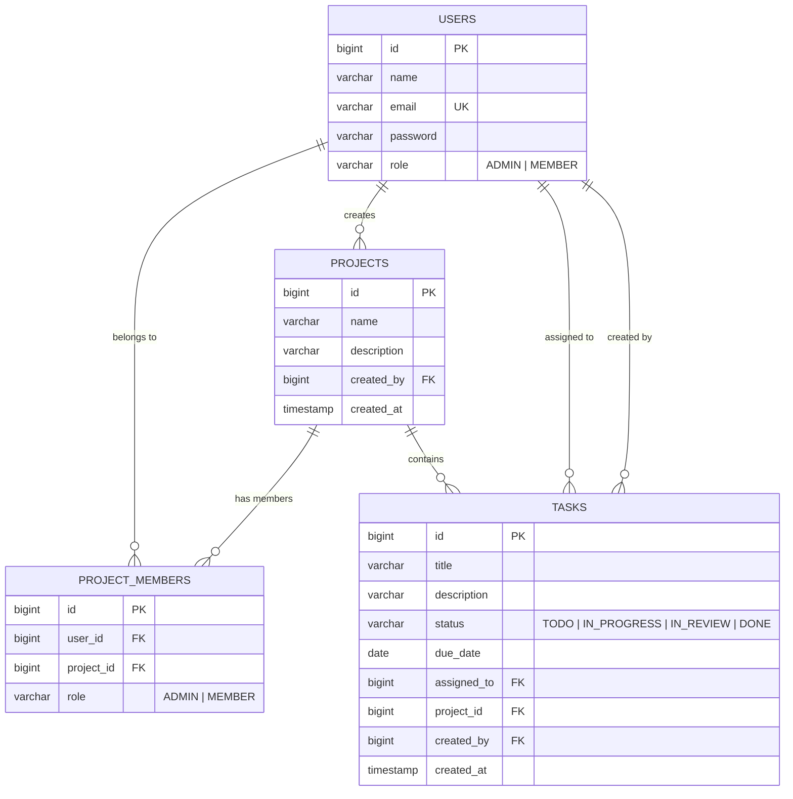

<div align="center">

# ⚡ Ethara — Team Task Manager

**A production-ready, full-stack team task management platform built with Spring Boot**

<p>
  <a href="https://openjdk.org/"></a>
  <a href="https://spring.io/projects/spring-boot"></a>
  <a href="https://www.postgresql.org/"></a>
  <a href="LICENSE"></a>
</p>

[Features](#-features) · [Architecture](#-architecture) · [Quick Start](#-quick-start) · [Deployment](#-deployment) · [API Reference](#-api-reference)

</div>

---

## 📋 Overview

**Ethara** *(meaning "impact")* is a modern, secure team task management application designed for collaborative project workflows. It provides a Kanban-style task board, role-based access control, real-time dashboard analytics, and an admin panel — all wrapped in a clean, minimalist black-and-white UI.

Built as a monolithic Spring Boot application with server-rendered Thymeleaf templates, Ethara is optimized for fast deployment on **Render**, **Railway**, **Heroku**, or via **Docker**.

---

## ✨ Features

### 🔐 Authentication & Security
- **JWT-based authentication** with HTTP-only cookie transport
- **BCrypt password hashing** for secure credential storage
- **Dual security filter chains** — stateless API layer + cookie-based web layer
- **XSS protection**, `X-Frame-Options`, and content-type sniffing prevention
- **Role-based access control** — `ADMIN` and `MEMBER` system roles

### 📊 Dashboard
- Real-time summary metrics: total tasks, completed, pending, overdue
- Task distribution breakdown by status (TODO, IN_PROGRESS, IN_REVIEW, DONE)
- Overdue task alerts with visual indicators
- Personalized per-user analytics

### 📁 Project Management
- Create and manage multiple projects
- Add team members with project-level roles (`ADMIN` / `MEMBER`)
- Project-scoped task isolation with unique membership constraints

### ✅ Task Board (Kanban)
- **Four-column board**: `TODO` → `IN_PROGRESS` → `IN_REVIEW` → `DONE`
- Task assignment to project members with due date tracking
- Automatic overdue detection and rich task descriptions (up to 2,000 chars)

### 🛡️ Admin Panel
- System-wide user management — view, assign roles, delete users
- Global visibility into all projects and tasks
- Protected with `ADMIN`-only authorization

---

## 🏗 Architecture

```
Client Browser (Thymeleaf + Vanilla JS)
         │
         │  HTTP (Cookie: JWT)
         ▼
 ┌─────────────────────────────┐
 │      Spring Boot 3.4.5      │
 │  Security → Controllers     │
 │  Controllers → Services     │
 │  Services → JPA Repos       │
 └────────────┬────────────────┘
              │ JDBC
              ▼
       PostgreSQL 16
```

### Tech Stack

| Layer | Technology |
|---|---|
| **Language** | Java 21 |
| **Framework** | Spring Boot 3.4.5 |
| **Security** | Spring Security 6 + JWT (jjwt 0.12.6) |
| **Database** | PostgreSQL + Spring Data JPA / Hibernate |
| **Templating** | Thymeleaf + Thymeleaf Extras (Spring Security 6) |
| **Frontend** | Vanilla JavaScript + CSS |
| **Build** | Maven (with Maven Wrapper) |
| **Deployment** | Docker · Render · Railway · Heroku |

---

## 🚀 Quick Start

### Prerequisites
- Java 21 (JDK)
- PostgreSQL 16+ running locally
- Maven 3.9+ (or use the included Maven Wrapper)

### 1. Clone the Repository

```bash
git clone https://github.com/your-username/ethara.git
cd ethara/App
```

### 2. Set Up the Database

```sql
CREATE DATABASE taskmanager;
```

### 3. Run the Application

```bash
# Windows
.\mvnw.cmd spring-boot:run -Dspring-boot.run.profiles=dev

# Linux / macOS
./mvnw spring-boot:run -Dspring-boot.run.profiles=dev
```

### 4. Open in Browser

```
http://localhost:8080
```

Sign up at `/signup`, log in at `/login`, and you'll land on the Dashboard.

> **Tip:** The `dev` profile enables SQL logging and disables Thymeleaf caching for faster iteration.

---

## ⚙️ Configuration

All config is externalized via environment variables with sensible defaults:

| Variable | Default | Description |
|---|---|---|
| `PORT` | `8080` | Server port |
| `DATABASE_URL` | `jdbc:postgresql://localhost:5432/taskmanager` | PostgreSQL JDBC URL |
| `DATABASE_USERNAME` | `postgres` | Database username |
| `DATABASE_PASSWORD` | *(set in properties)* | Database password |
| `DB_POOL_SIZE` | `5` | HikariCP max pool size |
| `JWT_SECRET` | *(default hex key)* | HMAC-SHA256 signing key |
| `JWT_EXPIRATION` | `86400000` (24h) | Token expiry in milliseconds |
| `DDL_AUTO` | `update` | Hibernate DDL strategy |
| `THYMELEAF_CACHE` | `true` | Enable/disable template caching |
| `SHOW_SQL` | `false` | Print SQL to console |
| `LOG_LEVEL` | `INFO` | Root logging level |
| `CORS_ORIGIN` | `http://localhost:8080` | Allowed CORS origins |

> **Important:** Always override `JWT_SECRET` with a strong random key in production.

---

## 🐳 Docker

```bash
cd App

# Build
docker build -t ethara .

# Run
docker run -d \
  --name ethara \
  -p 8080:8080 \
  -e DATABASE_URL=jdbc:postgresql://host.docker.internal:5432/taskmanager \
  -e DATABASE_USERNAME=postgres \
  -e DATABASE_PASSWORD=your_password \
  -e JWT_SECRET=your_production_secret \
  ethara
```

The `Dockerfile` uses a **two-stage build** — JDK for compiling, JRE for runtime — and runs as a non-root user for security. Includes a health check on `/login` every 30 seconds.

---

## ☁️ Deployment

### Render *(Recommended)*

1. Push your code to GitHub
2. Connect the repo to [Render](https://render.com)
3. Render auto-detects `render.yaml` and provisions the web service + PostgreSQL
4. Environment variables are configured automatically

### Heroku

```bash
heroku create ethara-app
heroku addons:create heroku-postgresql:essential-0
git push heroku main
```

### Railway / Fly.io

Use the Docker-based deployment and point to your PostgreSQL instance via environment variables.

---

## 📡 API Reference

All endpoints require a valid JWT via `Authorization: Bearer <token>` or HTTP-only cookie.

### Auth

| Method | Endpoint | Body | Description |
|---|---|---|---|
| POST | `/auth/signup` | `{ name, email, password }` | Register a new user |
| POST | `/auth/login` | `{ email, password }` | Login, returns JWT |

### Projects

| Method | Endpoint | Description |
|---|---|---|
| GET | `/api/projects` | List user's projects |
| POST | `/api/projects` | Create a new project |
| POST | `/api/projects/{id}/members` | Add a member |
| DELETE | `/api/projects/{id}/members/{userId}` | Remove a member |

### Tasks

| Method | Endpoint | Description |
|---|---|---|
| GET | `/api/projects/{id}/tasks` | List tasks in a project |
| POST | `/api/projects/{id}/tasks` | Create a task |
| PUT | `/api/tasks/{id}/status` | Update task status |

### Dashboard

| Method | Endpoint | Description |
|---|---|---|
| GET | `/api/dashboard/summary` | Summary metrics |
| GET | `/api/dashboard/my-tasks` | Tasks assigned to current user |
| GET | `/api/dashboard/overdue` | Overdue tasks |

### Admin *(ADMIN role only)*

| Method | Endpoint | Description |
|---|---|---|
| GET | `/api/admin/users` | List all users |
| PUT | `/api/admin/users/{id}/role` | Change a user's role |
| DELETE | `/api/admin/users/{id}` | Delete a user |

---

## 📁 Project Structure

```
App/
├── src/main/java/com/ethara/taskmanager/
│   ├── TaskManagerApplication.java
│   ├── controller/        # Auth, Project, Task, Dashboard, Admin, Web
│   ├── model/             # User, Project, ProjectMember, Task
│   ├── repository/        # Spring Data JPA repositories
│   ├── service/           # Business logic
│   ├── security/          # JwtFilter, JwtUtil, SecurityConfig
│   ├── dto/               # Request/response DTOs
│   └── exception/         # Global exception handling
├── src/main/resources/
│   ├── application.properties
│   ├── application-dev.properties
│   ├── static/css/style.css
│   ├── static/js/app.js
│   └── templates/         # login, signup, dashboard, projects, taskboard, admin
├── Dockerfile
├── Procfile
├── render.yaml
├── pom.xml
└── mvnw / mvnw.cmd
```

---

## 🗄️ Database Schema



---

## 🧪 Testing

```bash
./mvnw test
```

Includes **Spring Boot Test** and **Spring Security Test** for integration and security layer coverage.

---

## 🤝 Contributing

1. Fork the repository
2. Create a feature branch — `git checkout -b feature/amazing-feature`
3. Commit your changes — `git commit -m 'Add amazing feature'`
4. Push to the branch — `git push origin feature/amazing-feature`
5. Open a Pull Request

---

## 📝 License

Licensed under the **MIT License** — see [LICENSE](LICENSE) for details.

---

<div align="center">

**Built with ☕ Java and ❤️ by the Ethara team**

</div>